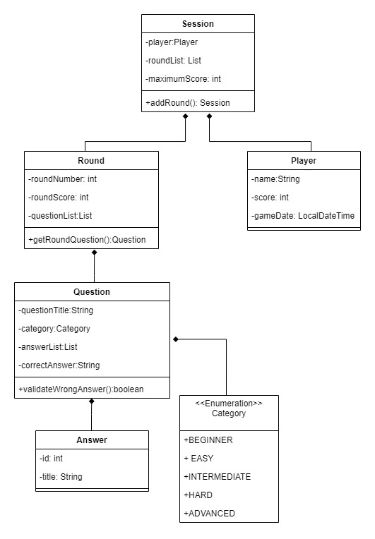

##QUESTION CHALLENGE

Consiste en el modelamiento de un concurso de preguntas y respuestas, el cual contiene un banco de 25 preguntas 
con cuatro opciones para una única respuesta. Cada pregunta se encuentra dentro de una categoría con un nivel de
dificultad. El concurso cuenta con 5 rondas donde en cada ronda se le asigna premio en puntos al jugador cuando
este responde correctamente las preguntas. Los puntos obtenidos en cada ronda dependen de la categoría en la que 
se encuentre la pregunta. Si el jugador responde correctamente a cada pregunta de las 5 rondas, gana, si por el 
contrario responde erradamente a una pregunta en cualquier ronda, pierde. 

###Modelado de Clases:

###Pre-requisitos: 📋

1. Tener Java 11 o versión posterior instalada.
2. Tener un IDE instalado, el de su preferencia. 
3. Tener plugin de Maven instalado en el IDE.

###Pasos para ejecutar el programa: ⚙️

1. Clonar el proyecto
2. Importar como proyecto Maven. 
3. Correr clase principal "App".

###Construido con:  🔧️

* [Maven](https://maven.apache.org/) - Maven, para gestionar las dependencias.
* [Java](https://www.oracle.com/java/technologies/downloads/#java11) - Java 11.
* [SQLiteStudio](https://sqlitestudio.pl/) - SQLiteStudio, para realizar la persistencia de datos. 

###Autores: ✒️
* **Yerlis González** - [yerlisg](https://github.com/yerlisg)

